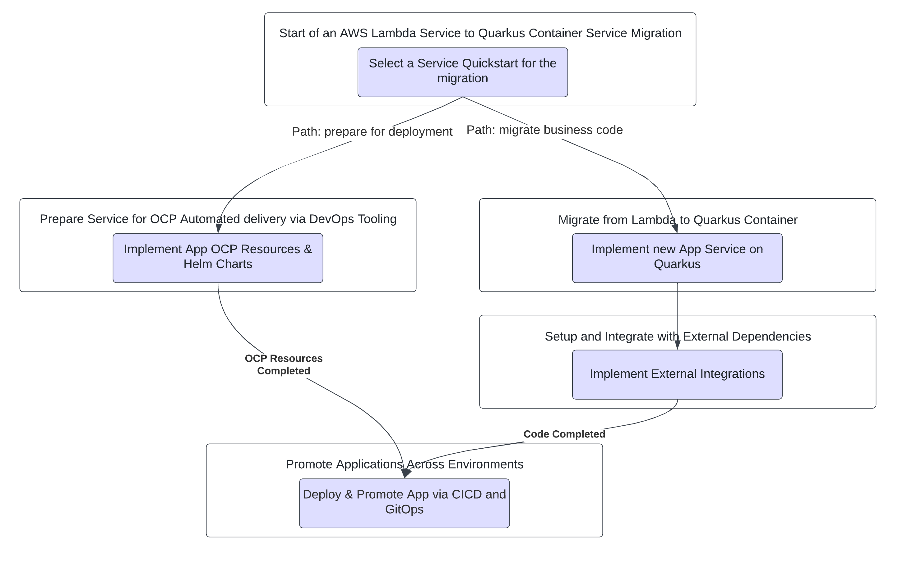

# Cookbook for activities to migrate AWS Java Lambda applications to AZURE/OCP

## Prerequisites
- GitOps with ArgoCD for the service/team has been setup see [[TODO] - Setting up GitOps with ArgoCD for service/team](TODO)
- Red Hat OpenShift Pipelines operator has been installed
- Red Hat OpenShift Service Mesh operator has been installed, `ServiceMeshControlPlane` configured, `ServiceMeshMemberRole` configured with the namespace (see [[TODO] - Service Mesh Setup](TODO)) 
- Datadog [[TODO] - has been installed](TODO) and configured to have access to this environment
- *(Optional)* Kafka Operator has been installed and Kafka instance, Kafka Clients, Kafka Topics have been configured [Kafka prerequisites](quickstart-lambda-to-quarkus-kafka/README.md#prerequisites)
- *(Optional)* Crossplane for database creation is in place and `master_key` and `connection` URL known

## Assumptions
For this guide, we will assume that your Lambda service is called `banana` to make the examples simple.

## `Banana` Lambda Migration Flow

### High Level Migration Flow

### Detailed Migration Flow

```mermaid
graph TB

  subgraph "Promote Applications Across Environments"
  Node5a[Promotion Namespaces Definition]
  Node5a -- Optional --> Node5b[Setup ArgoCD Application for CI Pipeline]
  Node5a --> Node5c[Setup ArgoCD Application for GitOps]
  click Node5a "https://gitlab.consulting.redhat.com/tech-specialists/aws-lambdas-to-azure-quakus-containers/blob/main/how-to-docs/automate-app-ocp-delivery.md#promotion-namespaces" "Promotion Namespaces"
  click Node5b "https://gitlab.consulting.redhat.com/tech-specialists/aws-lambdas-to-azure-quakus-containers/blob/main/how-to-docs/automate-app-ocp-delivery.md#create-new-service-pipeline-for-the-service-to-perform-continuous-integration" "CI Pipeline"
  click Node5c "https://gitlab.consulting.redhat.com/tech-specialists/aws-lambdas-to-azure-quakus-containers/blob/main/how-to-docs/automate-app-ocp-delivery.md#create-gitops-resources-for-the-new-service-to-perform-continuous-delivery" "CD Application"
  end

  subgraph "Prepare Service for OCP Automated delivery via DevOps Tooling"
  Node2b[Create Helm Chart]
  Node2b[Create Helm Charts] --> Node2c[create keyvault content]
  Node2b[Create Helm charts] --> Node2f[values.yaml]
  Node2f[values.yaml] -- optional --> Node2r[cosmosdb-claim.yaml]
  Node2f[values.yaml] -- optional --> Node2s[kafka-topic.yaml]
  Node2f[values.yaml] -- optional --> Node2d[kafka-user.yaml]
  Node2f[values.yaml] --> Node2g[configmap.yaml]
  Node2g[configmap.yaml] --> Node2h[externalsecret.yaml]
  Node2h[externalsecret.yaml] -- Expectation Someone to Generate the Vault Content --> Node2c[create keyvault content]
  Node2h[externalsecret.yaml] --> Node2i[roles.yaml]
  Node2i[roles.yaml] --> Node2j[roleBinding.yaml]
  Node2j[roleBinding.yaml] --> Node2k[serviceAccount.yaml]
  Node2k -- either  --> Node2l[deployment.yaml]
  Node2k -- or --> Node2q[cronjob.yaml]
  Node2l[deployment.yaml] --> Node2m[service.yaml]
  Node2m -- either via servicemesh --> Node2n[istio-virtualservice.yaml]
  Node2m -- or --> Node2o[route.yaml]
  Node2m -- or --> Node2p[NO EXTERNAL ACCESS]
  Node2n -- Resources Ready --> Node5a
  Node2o -- Resources Ready --> Node5a
  Node2p -- Resources Ready --> Node5a
  click Node2d "https://gitlab.consulting.redhat.com/tech-specialists/aws-lambdas-to-azure-quakus-containers/blob/main/how-to-docs/helm-chart-for-app-ocp-deployment.md#kafkauser-kafka-useryaml-resource-configuration-guidelines" "Kafka User Resource"
  click Node2f "https://gitlab.consulting.redhat.com/tech-specialists/aws-lambdas-to-azure-quakus-containers/blob/main/how-to-docs/helm-chart-for-app-ocp-deployment.md#valuesyaml-resource-configuration-guidelines" "values.yaml"
  click Node2g "https://gitlab.consulting.redhat.com/tech-specialists/aws-lambdas-to-azure-quakus-containers/blob/main/how-to-docs/helm-chart-for-app-ocp-deployment.md#configmap-configmapyaml-resource-configuration-guidelines" "configmap.yaml"
  click Node2h "https://gitlab.consulting.redhat.com/tech-specialists/aws-lambdas-to-azure-quakus-containers/blob/main/how-to-docs/helm-chart-for-app-ocp-deployment.md#externalsecret-externalsecretyaml-resource-configuration-guidelines" "externalsecret.yaml"
  click Node2c "https://gitlab.consulting.redhat.com/tech-specialists/aws-lambdas-to-azure-quakus-containers/blob/main/how-to-docs/helm-chart-for-app-ocp-deployment.md#externalsecret-externalsecretyaml-resource-configuration-guidelines" "keyvault"
  click Node2i "https://gitlab.consulting.redhat.com/tech-specialists/aws-lambdas-to-azure-quakus-containers/blob/main/how-to-docs/helm-chart-for-app-ocp-deployment.md#role-rolesyaml-resource-configuration-guidelines" "roles.yaml"
  click Node2j "https://gitlab.consulting.redhat.com/tech-specialists/aws-lambdas-to-azure-quakus-containers/blob/main/how-to-docs/helm-chart-for-app-ocp-deployment.md#rolebinding-rolebindingyaml-resource-configuration-guidelines" "roleBinding.yaml"
  click Node2k "https://gitlab.consulting.redhat.com/tech-specialists/aws-lambdas-to-azure-quakus-containers/blob/main/how-to-docs/helm-chart-for-app-ocp-deployment.md#serviceaccount-serviceaccountyaml-resource-configuration-guidelines" "serviceAccount.yaml"
  click Node2l "https://gitlab.consulting.redhat.com/tech-specialists/aws-lambdas-to-azure-quakus-containers/blob/main/how-to-docs/helm-chart-for-app-ocp-deployment.md#deployment-deploymentyaml-resource-configuration-guidelines" "deployment.yaml"
  click Node2q "https://gitlab.consulting.redhat.com/tech-specialists/aws-lambdas-to-azure-quakus-containers/blob/main/how-to-docs/helm-chart-for-app-ocp-deployment.md#cronjob-cronjobyaml-resource-configuration-guidelines" "cronjob.yaml"
  click Node2m "https://gitlab.consulting.redhat.com/tech-specialists/aws-lambdas-to-azure-quakus-containers/blob/main/how-to-docs/helm-chart-for-app-ocp-deployment.md#service-serviceyaml-resource-configuration-guidelines" "service.yaml"
  click Node2n "https://gitlab.consulting.redhat.com/tech-specialists/aws-lambdas-to-azure-quakus-containers/blob/main/how-to-docs/helm-chart-for-app-ocp-deployment.md#option-1-istio-virtualservice-for-service-mesh-based-service-resource-configuration-guidelines" "istio-virtualservice.yaml"
  click Node2o "https://gitlab.consulting.redhat.com/tech-specialists/aws-lambdas-to-azure-quakus-containers/blob/main/how-to-docs/helm-chart-for-app-ocp-deployment.md#option-2-openshift-route-for-non-service-mesh-based-service-resource-configuration-guidelines" "route.yaml"
  click Node2r "https://gitlab.consulting.redhat.com/tech-specialists/aws-lambdas-to-azure-quakus-containers/blob/main/how-to-docs/helm-chart-for-app-ocp-deployment.md#documentdatabase-cosmosdb-claimyaml-resource-configuration-guidelines" "Database Resource"
  click Node2s "https://gitlab.consulting.redhat.com/tech-specialists/aws-lambdas-to-azure-quakus-containers/blob/main/how-to-docs/helm-chart-for-app-ocp-deployment.md#kafkatopic-kafka-topicyaml-resource-configuration-guidelines" "Kafka Topic Resource"
  end

  subgraph "Activities to Setup and Integrate with External Dependencies"
  Node3a[External Dependencies]
  Node3a[External Dependencies] --> Node3b[Integrating with CosmosDB]
  Node3a[External Dependencies] --> Node3c[Integrating with Kafka]
  Node3b[Integrating with CosmosDB] -- Code Ready --> Node5a
  Node3c[Integrating with Kafka]  -- Code Ready --> Node5a
  click Node3b "https://gitlab.consulting.redhat.com/tech-specialists/aws-lambdas-to-azure-quakus-containers/blob/main/how-to-docs/migrate-business-application-code-in-quarkus.md#connecting--interacting-to-a-cosmosdb" "CosmosDB"
  click Node3c "https://gitlab.consulting.redhat.com/tech-specialists/aws-lambdas-to-azure-quakus-containers/blob/main/how-to-docs/migrate-business-application-code-in-quarkus.md#connecting--interacting-with-kafka" "Kafka"
  end

  subgraph "Migrate new Service Code from Lambda to Quarkus"
  Node1a[Setup Application Configurations]
  Node1a -- feed configs into --> Node2g[configmap.yaml]
  Node1a -- feed sensitive configs into --> Node2h[externalsecret.yaml]
  Node1b[Setup Application Metrics]
  Node1a --> Node1b[Setup Application Metrics]
  Node1b -- Option-1 --> Node1c[Migrating code into CronJob Quarkus Application Main]
  Node1b -- Option-2 --> Node1d[Migrating code into Long-running REST API Quarkus ApplicationScoped]
  Node1b -- Option-3 --> Node1e[Migrating code into Quarkus Scheduled]
  Node1b -- Option-4 --> Node1f[Migrating code into Kafka Triggered Quarkus]
  Node1c -- Optional --> Node3a[External Dependencies]
  Node1d -- Optional --> Node3a[External Dependencies]
  Node1e -- Optional --> Node3a[External Dependencies]
  Node1f -- Optional --> Node3a[External Dependencies]
  click Node1a "https://gitlab.consulting.redhat.com/tech-specialists/aws-lambdas-to-azure-quakus-containers/blob/main/how-to-docs/container-guidelines.md#a1---application-configuration" "App Configuration"
  click Node1b "https://gitlab.consulting.redhat.com/tech-specialists/aws-lambdas-to-azure-quakus-containers/blob/main/how-to-docs/container-guidelines.md#a2---application-metrics" "Setup Application Metrics"
  click Node1c "https://gitlab.consulting.redhat.com/tech-specialists/aws-lambdas-to-azure-quakus-containers/blob/main/how-to-docs/migrate-business-application-code-in-quarkus.md#option-a---migrating-code-of-cronjob-type-service-from-lambda-to-quarkus-application-main" "Start Migrating a CronJob"
  click Node1d "https://gitlab.consulting.redhat.com/tech-specialists/aws-lambdas-to-azure-quakus-containers/blob/main/how-to-docs/migrate-business-application-code-in-quarkus.md#option-b---migrating-code-of-rest-long-running-type-service-from-lambda-to-quarkus-applicationscoped-application" "Start Migrating a Rest Service"
  click Node1e "https://gitlab.consulting.redhat.com/tech-specialists/aws-lambdas-to-azure-quakus-containers/blob/main/how-to-docs/migrate-business-application-code-in-quarkus.md#option-c---migrating-code-of-scheduled-type-long-running-service-from-lambda-to-quarkus-scheduled-application" "Start Migrating a Scheduled Service"
  click Node1f "https://gitlab.consulting.redhat.com/tech-specialists/aws-lambdas-to-azure-quakus-containers/blob/main/how-to-docs/migrate-business-application-code-in-quarkus.md#option-d---migrating-code-of-message-triggered-based-long-running-service-from-lambda-to-quarkus-application" "Start Migrating a Message Triggered Service"
  end

  subgraph "Migrating an AWS Lambda Service to Quarkus Container Service"
  Node1[Start Migrating a Service] --> Node2[Choose a quickstart/skeleton quarkus service]
  Node2[Choose a quickstart/skeleton quarkus service] --> Node3[Containerize the application]
  Node3[Containerize the application] -- Path: prepare for deployment --> Node2b[Create Helm Chart]
  Node3[Containerize the application] -- Path: prepare business code --> Node1a[Setup Application Configurations]
  click Node2 "https://gitlab.consulting.redhat.com/tech-specialists/aws-lambdas-to-azure-quakus-containers/blob/main/how-to-docs/residency-quickstarts.md#list-of-quickstarts-for-the-migration-of-lambdas-to-quarkus" "Choose Quickstart"

end
```

