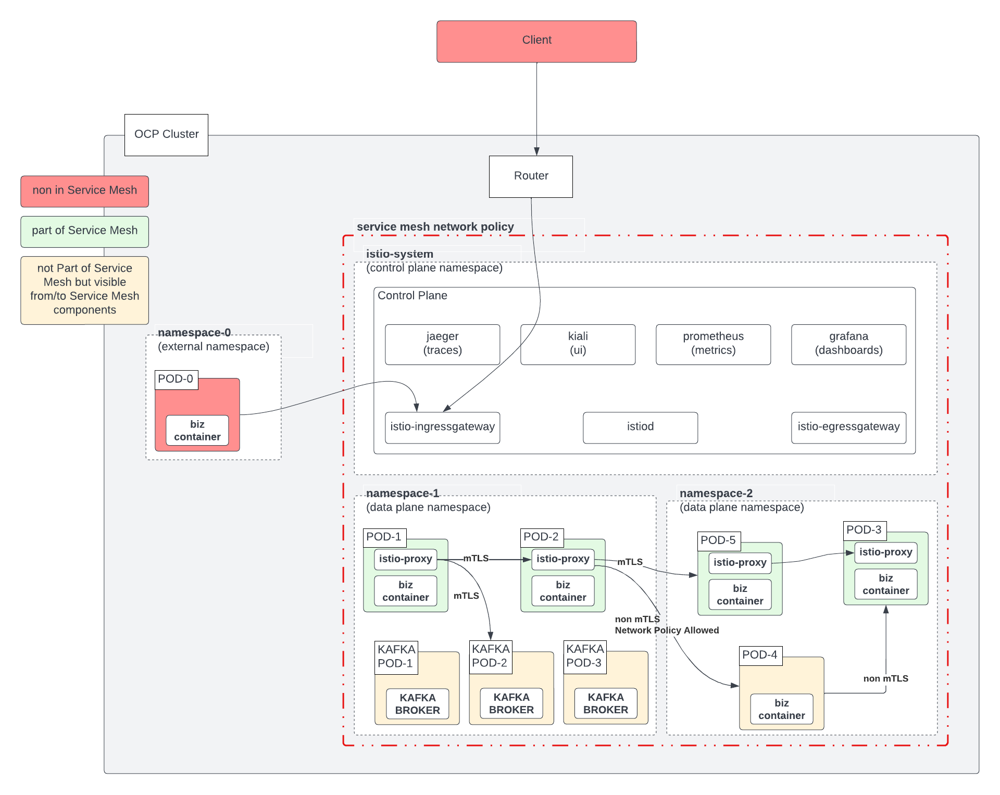

# Setting up Service Mesh 

## Introduction
This document describes how ServiceMesh is setup and gives some high-level advice on how we have designed it in the residency vs how it could be thought of beyond.

## What does part of the Service Mesh mean?




## Prerequisites

Before you set up the `Service Mesh` and host application namespaces and PODs within it, the following things are needed:

1. **Service Mesh deployment mode** (1 `Service Mesh` per domain, 1 per cluster or 1 per environment)
   1. In the residency since there is a 1-to-1 relationship of environment to set of namespaces we have selected 1 service mesh per environment deployment mode. The result is
     1. `dev-mesh`: is deployed in `istio-system-dev` and is the mesh controlplane for `labs-dev` dataplane
       * `dev-mesh` [Gitops Installation](https://github.com/cariad-cloud/residency-gitops/blob/49815ad929ee440b8d9989a528d4e07b1d253781/tooling/values-tooling.yaml#L337)
     2. `prod-mesh`: is deployed in `istio-system-prod`  and is the mesh controlplane for `labs-test` dataplane namespace
       * `prod-mesh` [Gitops Installation](https://github.com/cariad-cloud/residency-gitops/blob/49815ad929ee440b8d9989a528d4e07b1d253781/tooling/values-tooling.yaml#L345)
2. **Install** the `Red Hat Openshift Service Mesh (OSSM)` operator and dependent **operators**
   1. [Generic Instructions to install the operators](https://docs.openshift.com/container-platform/4.10/service_mesh/v2x/installing-ossm.html)
   2. In the residency we install operators via GitOps
     * **OpenShift Elasticsearch Operator [GitOps Installation](https://github.com/cariad-cloud/residency-gitops/blob/49815ad929ee440b8d9989a528d4e07b1d253781/tooling/values-tooling.yaml#L224):** Can be used for long-term storage of Jaeger Traces (not used)
     * **Red Hat OpenShift distributed tracing Operator (Jaeger) [GitOps Installation](https://github.com/cariad-cloud/residency-gitops/blob/49815ad929ee440b8d9989a528d4e07b1d253781/tooling/values-tooling.yaml#L166):** Integrates with the `OSSM` to store `dataplane` traces
     * **Kiali Operator [GitOps Installation](https://github.com/cariad-cloud/residency-gitops/blob/49815ad929ee440b8d9989a528d4e07b1d253781/tooling/values-tooling.yaml#L147):** `OSSM` configuration and runtime visualization
     * **Red Hat OpenShift Service Mesh Operator [GitOps Installation](https://github.com/cariad-cloud/residency-gitops/blob/49815ad929ee440b8d9989a528d4e07b1d253781/tooling/values-tooling.yaml#L185):** Configures the characteristics of the Service Mesh and applies network, security, routing policies applied in the dataplane  

## Setup

1. To set up the mesh `controlplane` a resource `ServiceMeshControlPlane` is defined in:
  * [`dev-mesh ServiceMeshControlPlane`](https://github.com/cariad-cloud/residency-helm-charts/blob/main/servicemesh-dev/templates/servicemeshcontrolplane.yaml)
  * [`prod-mesh ServiceMeshControlPlane`](https://github.com/cariad-cloud/residency-helm-charts/blob/main/servicemesh-prod/templates/servicemeshcontrolplane.yaml)
2. To add namespaces and PODs in the Service Mesh `dataplane`
  * The resource [`dev-mesh ServiceMeshMemberRoll`](https://github.com/cariad-cloud/residency-helm-charts/blob/main/servicemesh-dev/templates/servicememberrole.yaml) and [`values.yaml`](https://github.com/cariad-cloud/residency-helm-charts/blob/main/servicemesh-dev/values.yaml) take care `dev-mesh` dataplane setup
  * [`dev-mesh ServiceMeshMemberRoll`](https://github.com/cariad-cloud/residency-helm-charts/blob/main/servicemesh-prod/templates/servicememberrole.yaml) and [`values.yaml`](https://github.com/cariad-cloud/residency-helm-charts/blob/main/servicemesh-prod/values.yaml) take care `dev-mesh` dataplane setup
  * final piece for the MicroServices to become part of the mesh is to add the following `annotation` in their deployment configuration:
  ```YAML
     spec:
       template:
         metadata:
           annotations:   
             sidecar.istio.io/inject: 'true'   
  ```

## Configuration

* In order to configure the `ServiceMeshControlPlane` the [githib ascidocs](https://github.com/maistra/api/blob/maistra-2.1/docs/crd/maistra.io_ServiceMeshControlPlane_v2.adoc) and/or `oc explain smcp.spec` would be a starting point
* The main areas of configuraton are

* smcp resource
```YAML
apiVersion: maistra.io/v2
kind: ServiceMeshControlPlane
metadata:
  name: dev-mesh
```
* security (`STRICT` mtls in `controlplane` and `dataplane`)
```YAML
spec:
  security:
    controlPlane:
      mtls: true
    dataPlane:
      mtls: true
      automtls: true
```

  * As a result of the above configuration the `OSSM` applies a `PeerAuthentication` resource with `STRICT` mode 
  ```YAML  
    oc get PEERAUTHENTICATION -n istio-system-prod
    NAME                            MODE         AGE
    default                         STRICT       13d
    disable-mtls-jaeger-collector   DISABLE      13d
    grafana-ports-mtls-disabled     PERMISSIVE   13d
  ```

* tracing offloaded to `Jaeger`, sampling 100% (turn to 100 0.1% for prod)
```YAML  
  tracing:
    sampling: 10000
    type: Jaeger
```
* logging
```YAML  
  general:
    logging:
      logAsJSON: true
```  

* sidecar proxy configuration (logging on removed in prod setup, networking outgoing `ALLOW_ANY` destination) 
```YAML  
  proxy:
    accessLogging:
      file:
        name: /dev/stdout
    networking:
      trafficControl:
        inbound: {}
        outbound:
          policy: ALLOW_ANY
```

* Additional supporting components 
```YAML
  addons:
    grafana:
      enabled: true
    jaeger:
      install:
        storage:
          type: Memory
    kiali:
      enabled: true
    prometheus:
      enabled: true
```

* Runtime configurations (Service Mesh control plane scaling)
```YAML
  runtime:
    components:
      pilot:
        deployment:
          autoScaling:
            enabled: true
            maxReplicas: 1
            minReplicas: 1
```    
* Controlplane version
```YAML        
  version: v2.1
```    

## Configure External CA

[Adding an existing certificate](https://docs.openshift.com/container-platform/4.10/service_mesh/v2x/ossm-security.html#ossm-cert-manage-add-cert-key_ossm-security) and key for the generation of service mesh certificates used in the dataplane.


