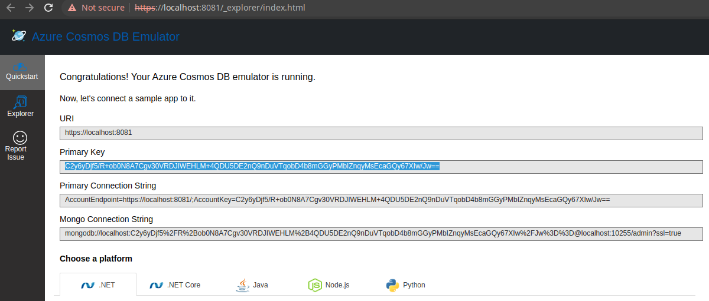
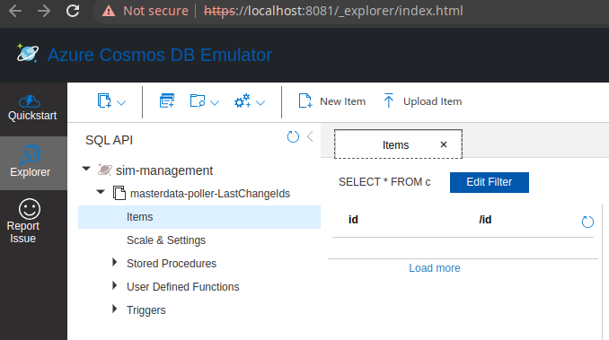

# Quarkus Scheduled Quickstart

This quickstart is a good place to start if you are migrating lambda functions that are running at scheduled intervals. It demonstrates, connecting and authenticating with Kafka, publishing and subscribing to messages.

This project attempts to be the simplest possible project that provides a manual workflow for deploying an application with the following features:

* Written using Java and Maven.
* Apache Kafka mutual-tls Connectivity
* Apache Kafka Publish and Subscribe
* Database connection to Cosmos DB
* Application built as a container using docker or podman, and pushed to remote registry, in the Azure Container registry.
* Container deploys to Openshift, and connects to Apache Kafka.

**During the lambda migration, all of the manual steps in this workflow will be replaced by automated CICD piplines**

# Migrating a Scheduled Based (Repeatable Running) Lambda to Quarkus Application

## Define Configurations
* Add configurations for local development and testing in [`src/main/resources/application.properties`](src/main/resources/application.properties) 
* Add configurations for deployment to Openshift in [`helm chart values`](chart/values.yaml) and [`helm chart template resources`](chart)
* Quarkus application dependencies are defined in the [pom.xml](pom.xml). Note these are the dependencies for scheduler service, Kafka and Cosmoddb integrations
  ```XML
    <dependency>
      <groupId>io.quarkus</groupId>
      <artifactId>quarkus-scheduler</artifactId>
    </dependency>
    <dependency>
      <groupId>io.quarkus</groupId>
      <artifactId>quarkus-smallrye-reactive-messaging-kafka</artifactId>
    </dependency>
    <dependency>
      <groupId>com.azure</groupId>
      <artifactId>azure-cosmos</artifactId>
      <version>${azure-cosmos.version}</version>
    </dependency>  
  ```
  
## Code Migrations
* Java Lambda to `QuarkusApplication`
  * Identify the main Lambda Function and start code migration from it eg.
  ```JAVA
        public void handleRequest() { .. }
  ```

* For a lambda which starts as the result of a scheduled event place the lambda code in [PollOrchestrator.java#dmdScheduler](src/main/java/com/redhat/cloudnative/simmanagement/datahandler/pollers/function/PollOrchestrator.java) adjusting accordingly the `@Scheduled()` intervals
  ```JAVA
  @ApplicationScoped
  public class PollOrchestrator {

    // FIXME - Call the Lambda handle method
    @Inject
    LambdaFunction dmdPoller;
  
    @Inject
    LastFetchedEventRepository lastFetchedEventRepository;
  
    public PollOrchestrator() {
    }
  
    @Scheduled(every = "10s")
    public void dmdScheduler() {
      try {
  
        logger.info("******************* dmdScheduler scheduled *******************");
        // FIXME - Call the Lambda handle method
        dmdPoller.handleEvent(UUID.randomUUID().toString());
  
        registry.counter("country_counter", Tags.of("name", "dmdScheduled")).increment();
  
      }  catch (Exception e) {
        logger.error("Unknown exception for DMD Scheduler: {}", e.getMessage(), e);
      }
    }
  }
  ```
* CosmosDB Connection and Use
  * For Connection see [CosmosConnection.java](src/main/java/com/redhat/cloudnative/simmanagement/datahandler/pollers/repository/CosmosConnection.java)
  * For use of the DB see [LastFetchedEventRepository](src/main/java/com/redhat/cloudnative/simmanagement/datahandler/pollers/repository/LastFetchedEventRepository.java)
  ```JAVA
  @Startup
  @ApplicationScoped
  public class LastFetchedEventRepository {
  
    // connection
    @Inject
    CosmosConnection connection;
  
    CosmosContainer table;
  
    ...
    
    // Initialization of container
    @PostConstruct
    public void initialise() {
      this.table = connection.getContainer();
    }
  
    ...
    
    // Read
    private String getLastChangeId(String keyValue, String tenant) {
      CosmosItemResponse<ChangeId> response= null;
      try{
        response = table.readItem(keyValue, new PartitionKey(keyValue), ChangeId.class);
      }
      ...
       return response.getItem().getValue();
    }
  
    // Insert/Update
    public void saveLastDmdEventTimestamp(String timestamp, String tenant) {
      table.upsertItem(new ChangeId(DMD_CHANGE_TIMESTAMP_KEY, DMD_CHANGE_TIMESTAMP_KEY, timestamp));
      ...
    }
  
  }
  ```
  * Kafka Connection and Use to emit messages [MasterDataPoller.java](src/main/java/com/redhat/cloudnative/simmanagement/datahandler/pollers/function/MasterDataPoller.java)
  ```JAVA
  @ApplicationScoped
  public abstract class MasterDataPoller {
      
    //FIXME - Look for sim-state-manager in application.properties and update accordingly
    @Inject
    @Channel("sim-state-manager")
    @Broadcast
    Emitter<SimEvent> simStateEmitter;
    
    void handleNotifications(SimEvent event) {
     sendMessage(Message.of(event));
    }
  
    private void sendMessage(Message<SimEvent> msg){
    logger.info("SendMessage : Successfully written message to Kafka topic [sim-state-manager]: "+simStateEmitter.toString());
    simStateEmitter.send(msg);
    }
  }
  ```

# Prerequisites

* An Azure login
* An Azure container Registry
* A login to an Openshift 4 cluster
* Red Hat's AMQ Streams Operator, this deploys and manages Kafka clusters and is otherwise known as Strimzi.
* An Azure cosmodb instance

Below is an example of a Custom Resource (`CR`) that creates a Kafka cluster.

```YAML
apiVersion: kafka.strimzi.io/v1beta2
kind: Kafka
metadata:
  annotations:
  name: wc-test-kafka-cluster
spec:
  entityOperator:
    topicOperator: {}
    userOperator: {}
  kafka:
    config:
      default.replication.factor: 3
      inter.broker.protocol.version: '3.1'
      min.insync.replicas: 2
      offsets.topic.replication.factor: 3
      transaction.state.log.min.isr: 2
      transaction.state.log.replication.factor: 3
    listeners:
      - name: plain
        port: 9092
        tls: false
        type: internal
      - name: tls
        port: 9093
        tls: true
        type: internal
      - name: external
        port: 9094
        tls: true
        type: route
      - authentication:
          enablePlain: true
          type: tls
        name: mtls
        port: 9095
        tls: true
        type: route
    replicas: 3
    storage:
      size: 30Gi
      type: persistent-claim
    version: 3.3.1
  zookeeper:
    replicas: 3
    storage:
      size: 10Gi
      type: persistent-claim
```

Secrets necessary to connect to this cluster without mtls will be created in the same namespace.

This Kafka cluster has three brokers, persistent storage. Additionally an endpoint where users can connect and establish identity cryptographically with mutual tls. Secrets for this user will be automatically created.

Below is the Custom Resource (`CR`) to create a user for mtls authentication :

```YAML
apiVersion: kafka.strimzi.io/v1beta2
kind: KafkaUser
metadata:
  annotations:
  name: quickstart-kafka-user
  labels:
    strimzi.io/cluster: wc-test-kafka-cluster
spec:
  authentication:
    type: tls
```

Note the reference to the cluster via a label defined above.


Below is the Custom Resource (`CR`) that defines a Kafka Topic, not tics that it defines the time a message is allowed to stay on the topic, and the total size in bytes of all messages in the topic, when one of these thresholds is reached old messages are evicted.

```YAML
apiVersion: kafka.strimzi.io/v1beta2
kind: KafkaTopic
metadata:
  annotations:
  name: quickstart-kafka-in
  labels:
    strimzi.io/cluster: wc-test-kafka-cluster
spec:
  config:
    retention.ms: 604800000
    segment.bytes: 1073741824
  partitions: 1
  replicas: 3
```

A single partition guarantees message ordering, multiple replicas, message resilience.

* Apply the prerequisites `CR` in an Openshift cluster
  ```shell script
  oc apply -f prerequisites/prerequisites.yaml
  ```

# Running & Testing the application

This project uses Quarkus, the Supersonic Subatomic Java Framework.

If you want to learn more about Quarkus, please visit its website: https://quarkus.io/ .

## Running the application in dev mode

* Run locally Kafka
  ```shell script
  docker|podman-compose up
  ```

* Run locally cosmodb
  ```shell script
  cd image-build 
  start-local-cosmosdb.sh docker|podman
  ```
  * Retrieve the cosmodb Primary Key by going to https://localhost:8081/_explorer/index.html and configure `%dev.cosmos.master.key` in [`src/main/resources/application.properties`](src/main/resources/application.properties) 
   

  * Configure local application `cacerts` to include the certs for the cosmodb
  ```shell script
  cd image-build 
  ./cosmodb-cert-in-cacerts.sh
  ```

* You can now run your application in dev mode that enables live coding using:
  ```shell script
  mvn compile quarkus:dev
  ``` 
  * The cosmodb connection has been established and a database has been created (see https://localhost:8081/_explorer/index.html)
    
  * The Scheduled service results in messages being placed every `10s` in the `sim-state-manager"` topic
    ```shell script
    podman exec -it 9f529e160847 ./bin/kafka-console-consumer.sh --bootstrap-server localhost:9092 --topic sim-state-manager --from-beginning
    {"externalId":"1bb4480f-83a0-4017-bf5c-25ea8b8b490e","event":"DEVICE_DATA_UPDATED","message":"Update 1","data":"additional information","statusCode":null,"trackingId":"f1da9a30-0301-4ffd-94ca-a4fc0b826d14"}
    {"externalId":"17d48cc9-bacf-4cbb-bc62-6b004e434562","event":"DEVICE_DATA_UPDATED","message":"Update 1","data":"additional information","statusCode":null,"trackingId":"5704c1aa-e58c-4a69-b7ff-0e1b041286fd"}
    {"externalId":"28257bcb-e1d0-4b1d-ab62-78837e704d80","event":"DEVICE_DATA_UPDATED","message":"Update 1","data":"additional information","statusCode":null,"trackingId":"56837ab1-058a-4353-b0eb-1da27a7d8ba8"}
    {"externalId":"35178044-cd1f-4779-a550-77fcdcb6a51a","event":"DEVICE_DATA_UPDATED","message":"Update 1","data":"additional information","statusCode":null,"trackingId":"acc879b3-3387-4044-8433-b88dcd90eae2"}

    ```
  * The application logs correlate the above results
    ```shell
    2023-06-09 09:45:44,952 INFO  [io.sma.rea.mes.kafka] (smallrye-kafka-producer-thread-0) SRMSG18258: Kafka producer kafka-producer-sim-state-manager, connected to Kafka brokers 'localhost:9092', is configured to write records to 'sim-state-manager'
    2023-06-09 09:45:44,995 INFO  [com.red.clo.sim.dat.pol.fun.PollOrchestrator] (Quarkus Main Thread) ******************* dmdScheduler STARTING *******************
    2023-06-09 09:45:44,997 INFO  [com.red.clo.sim.dat.pol.rep.CosmosConnection] (Quarkus Main Thread) Creating Cosmos Client for container : masterdata-poller-LastChangeIds
    2023-06-09 09:45:45,001 INFO  [com.red.clo.sim.dat.pol.fun.PollOrchestrator] (vert.x-worker-thread-1) ******************* dmdScheduler scheduled *******************
    2023-06-09 09:45:45,003 INFO  [com.red.clo.sim.dat.pol.fun.MasterDataPoller] (vert.x-worker-thread-1) SendMessage : Successfully written message to Kafka topic [sim-state-manager]: io.smallrye.reactive.messaging.providers.extension.EmitterImpl@1b89de4a
    2023-06-09 09:45:45,199 INFO  [com.azu.cos.imp.RxDocumentClientImpl] (Quarkus Main Thread) Initializing DocumentClient [1] with serviceEndpoint [https://localhost:8081], connectionPolicy [ConnectionPolicy{httpNetworkRequestTimeout=PT1M, tcpNetworkRequestTimeout=PT5S, connectionMode=DIRECT, maxConnectionPoolSize=1000, idleHttpConnectionTimeout=PT1M, idleTcpConnectionTimeout=PT0S, userAgentSuffix='masterdata-poller-LastChangeIds', throttlingRetryOptions=RetryOptions{maxRetryAttemptsOnThrottledRequests=9, maxRetryWaitTime=PT30S}, endpointDiscoveryEnabled=true, preferredRegions=[West US], multipleWriteRegionsEnabled=true, proxyType=null, inetSocketProxyAddress=null, readRequestsFallbackEnabled=true, connectTimeout=PT5S, idleTcpEndpointTimeout=PT1H, maxConnectionsPerEndpoint=130, maxRequestsPerConnection=30, tcpConnectionEndpointRediscoveryEnabled=true, ioThreadPriority=5, ioThreadCountPerCoreFactor=2, tcpHealthCheckTimeoutDetectionEnabled=true, minConnectionsPerEndpoint=1, defensiveWarmupConcurrency=1, aggressiveWarmupConcurrency=8}], consistencyLevel [Eventual], directModeProtocol [Tcp]
    2023-06-09 09:45:45,267 INFO  [com.azu.cos.imp.RxDocumentClientImpl] (cosmos-parallel-1) Getting database account endpoint from https://localhost:8081
    2023-06-09 09:45:55,000 INFO  [com.red.clo.sim.dat.pol.fun.PollOrchestrator] (vert.x-worker-thread-1) ******************* dmdScheduler scheduled *******************
    2023-06-09 09:45:55,001 INFO  [com.red.clo.sim.dat.pol.fun.MasterDataPoller] (vert.x-worker-thread-1) SendMessage : Successfully written message to Kafka topic [sim-state-manager]: io.smallrye.reactive.messaging.providers.extension.EmitterImpl@1b89de4a
    2023-06-09 09:46:05,000 INFO  [com.red.clo.sim.dat.pol.fun.PollOrchestrator] (vert.x-worker-thread-1) ******************* dmdScheduler scheduled *******************
    2023-06-09 09:46:05,001 INFO  [com.red.clo.sim.dat.pol.fun.MasterDataPoller] (vert.x-worker-thread-1) SendMessage : Successfully written message to Kafka topic [sim-state-manager]: io.smallrye.reactive.messaging.providers.extension.EmitterImpl@1b89de4a
    ```

  > **_NOTE:_**  Quarkus now ships with a Dev UI, which is available in dev mode only at http://localhost:8080/q/dev/.

## [TO TEST HERE ONWARDS] Packaging and running the application

The application can be packaged using:
```shell script
./mvnw package
```
It produces the `quarkus-run.jar` file in the `target/quarkus-app/` directory.
Be aware that it’s not an _über-jar_ as the dependencies are copied into the `target/quarkus-app/lib/` directory.

The application is now runnable using `java -jar target/quarkus-app/quarkus-run.jar`.

If you want to build an _über-jar_, execute the following command:
```shell script
./mvnw package -Dquarkus.package.type=uber-jar
```

The application, packaged as an _über-jar_, is now runnable using `java -jar target/*-runner.jar`.

### Building & Testing the Container

Use the scripts in `image-build` and [Guidelines for building application and any external dependency containers for local functional tests](https://github.com/cariad-cloud/residency-docs/blob/developer-delivery-cookbook/how-to-docs/local-container-building-fort-testing.md) to test it localLy.

you should see some activity in the log, you can go to the Cosmos DB Data Explorer to see your data.

## Push the image to the a Container registry

```
image-build/image-deploy-to-registry.sh podman|docker
```

This script will push the container image to :

```
residencyregistry.azurecr.io/quickstart-scheduled/quickstart-scheduled
```

# Deploy the Image to OpenShift

## Login to the Openshift webconsole

Login at

```
https://console-openshift-console.apps.arcaroytxry.westus2.aroapp.io/
```

## Download the oc cli

Click on the "?" in the top right, click the "Command Line Tools" link

Download the oc cli for your laptops architecure

## Openshift CLI Login
First Login, get the login command from the webcosole. Click on your name in top right corner, click the "Copy Login Command", click "Display Tokem" link. Copy the login command, for instance :

```
oc login --token=<YOUR TOKEN> --server=https://api.arcaroytxry.westus2.aroapp.io:6443

```
