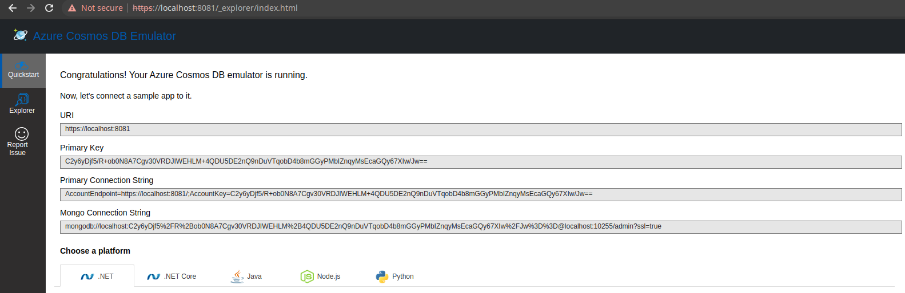
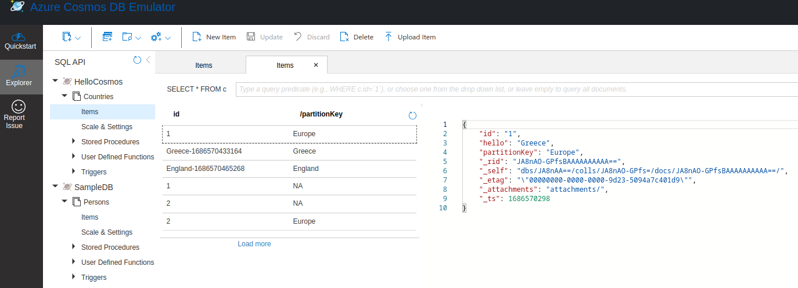

# Quarkus Rest Quickstart

This quickstart is a good place to start if you are migrating lambda functions that is running as a result of REST request. It demonstrates, exposure of a REST API resulting in a CosmosDB Connection and entry creation.

This project attempts to be the simplest possible project that provides a manual workflow for deploying an application with the following features:

* Written using Java and Maven.
* Database connection to Cosmos DB
* Application built as a container using docker or podman, and pushed to remote registry, in the Azure Container registry.
* Container deploys to Openshift, and connects to Cosmos.
* Serverless Service Startup

**During the lambda migration, all of the manual steps in this workflow will be replaced by automated CICD piplines**

# Migrating a Rest API Based Lambda to Quarkus Application

## Define Configurations
* Add configurations for local development and testing in [`src/main/resources/application.properties`](src/main/resources/application.properties)
* Add configurations for deployment to Openshift in [`helm chart values`](chart/values.yaml) and [`helm chart template resources`](chart)
* Quarkus application dependencies are defined in the [pom.xml](pom.xml). Note these are the dependencies for scheduler service, Kafka and Cosmoddb integrations
  ```XML
    <dependency>
      <groupId>io.quarkus</groupId>
      <artifactId>quarkus-scheduler</artifactId>
    </dependency>
    <dependency>
      <groupId>io.quarkus</groupId>
      <artifactId>quarkus-smallrye-reactive-messaging-kafka</artifactId>
    </dependency>
    <dependency>
      <groupId>com.azure</groupId>
      <artifactId>azure-cosmos</artifactId>
      <version>${azure-cosmos.version}</version>
    </dependency>  
  ```
## Code Migrations

* Java Lambda to `QuarkusApplication`
  * Identify the main Lambda Function and start code migration from it eg.
  ```JAVA
        public void handlerRequest() { .. }
  ```

* For a lambda which starts as the result of REST API call place the lambda code in [HelloCosmosResource.java#hello](src/main/java/com/redhat/cloudnative/hellocosmos/HelloCosmosResource.java) adjusting accordingly the `@Path` URIs
  ```JAVA
    @ApplicationScoped
    @Path("/hello")
    public class HelloCosmosResource {
    
        @Inject
        MeterRegistry registry;
           
        @Inject
        protected CosmosConnection connection;
           
        @GET
        @Produces(MediaType.TEXT_PLAIN)
        @Path("{country}")
        public String hello(String country) {
    
            // FIXME - Business Code call to Lambda hander method
            ...
        }
    
        @POST
        @Produces(MediaType.TEXT_PLAIN)
        @Consumes(MediaType.APPLICATION_JSON)
        @Path("/create")
        public String helloPost(HelloCountry hc) {
    
            // FIXME - Business Code call to Lambda hander method
            ...
        }
    
    }
  ```

* CosmosDB Connection and Use
  * For Connection see [CosmosConnection.java](src/main/java/com/redhat/cloudnative/hellocosmos/CosmosConnection.java)
  * For configuration of the DB see [application.properties](src/main/resources/application.properties) and define `cosmos.database`, `cosmos.container`, `cosmos.master.key`, `attribute.connection_string.0`. For use of the DB see [`CosmosConnection.java#init`](src/main/java/com/redhat/cloudnative/hellocosmos/CosmosConnection.java))
  ```JAVA
    @ApplicationScoped
    public class CosmosConnection {
    
        @ConfigProperty(name = "cosmos.database")
        protected String databaseName;
    
        @ConfigProperty(name = "cosmos.container")
        protected String containerName;
    
        @ConfigProperty(name = "cosmos.master.key")
        public String masterKey;
    
        @ConfigProperty(name = "attribute.connection_string.0")
        public String connectionString;
    
    
        @PostConstruct
        public void init()    {
    
            ...
    
            //  Create sync client
            client = new CosmosClientBuilder()
                .endpoint(host)
                .key(masterKey)
                .preferredRegions(preferredRegions)
                .userAgentSuffix("HelloCosmos")
                .consistencyLevel(ConsistencyLevel.EVENTUAL)
                .buildClient();
    
                try {
                    connect();
                } catch (Exception e) {
                    e.printStackTrace();
                }
    
        }
    
        private void connect() {
            //  Create database if not exists
            database = client.getDatabase(databaseName);
            container = database.getContainer(containerName);
        }
    
        public CosmosContainer getContainer() {
            return container;
        }
      
      }
  ```

# Prerequisites

* An Azure login
* An Azure container Registry
* A login to an Openshift 4 cluster
* An Azure cosmodb instance

# Running & Testing the application

This project uses Quarkus, the Supersonic Subatomic Java Framework.

If you want to learn more about Quarkus, please visit its website: https://quarkus.io/ .

## Running the application in dev mode

* Run locally cosmodb
  ```shell script
  cd image-build 
  start-local-cosmosdb.sh docker|podman
  ```
  * Retrieve the cosmodb Primary Key by going to https://localhost:8081/_explorer/index.html and configure with its value `%dev.cosmos.master.key` in [`src/main/resources/application.properties`](src/main/resources/application.properties)
    

  * Configure local application `cacerts` to include the certs for the cosmodb so the Java application can use them when connecting to cosmodb
    ```shell script
    cd image-build 
    ./cosmodb-cert-in-cacerts.sh
    ```

* You can now run your application in dev mode that enables live coding using:
  ```shell script
  mvn compile quarkus:dev
  ``` 

  * Test via curl `/hello/creation` 
    ```shell script
    curl -X POST http://localhost:8080/hello/create -H 'accept: text/plain' -H 'Content-Type: application/json' -d '{ "id": "1", "hello": "Greece", "partitionKey": "Europe" }'
    curl -X POST http://localhost:8080/hello/create -H 'accept: text/plain' -H 'Content-Type: application/json' -d '{ "id": "1", "hello": "England", "partitionKey": "Europe" }'
    curl -X POST http://localhost:8080/hello/create -H 'accept: text/plain' -H 'Content-Type: application/json' -d '{ "id": "2", "hello": "Canada", "partitionKey": "NA" }'
    curl -X POST http://localhost:8080/hello/create -H 'accept: text/plain' -H 'Content-Type: application/json' -d '{ "id": "2", "hello": "USA", "partitionKey": "NA" }'
    curl -X POST http://localhost:8080/hello/create -H 'accept: text/plain' -H 'Content-Type: application/json' -d '{ "id": "3", "hello": "France", "partitionKey": "Europe" }'
    curl -X POST http://localhost:8080/hello/create -H 'accept: text/plain' -H 'Content-Type: application/json' -d '{ "id": "3", "hello": "France", "partitionKey": "Italy" }'
    ``` 

    It should result in items created in the database
   
    
  
  * Test via curl `/hello/France`
    ```BASH
    curl -X GET http://localhost:8080/hello/France -H 'accept: text/plain'
    ```
* For unit `Test` (**Note:** you need in the `application.properties` to point to an active CosmosDB via `attribute.connection_string.0`, `cosmos.master.key` )
  ```BASH
  mvn clean test -s settings.xml
  ``` 

  > **_NOTE:_**  Quarkus now ships with a Dev UI, which is available in dev mode only at http://localhost:8080/q/dev/ and Swagger UI http://localhost:8080/q/swagger-ui

## Packaging and running the application

The application can be packaged using:
```shell script
mvn package
```
It produces the `quarkus-run.jar` file in the `target/quarkus-app/` directory.
Be aware that it’s not an _über-jar_ as the dependencies are copied into the `target/quarkus-app/lib/` directory.

The application is now runnable using `java -jar target/quarkus-app/quarkus-run.jar`.

If you want to build an _über-jar_, execute the following command:
```shell script
mvn package -Dquarkus.package.type=uber-jar
```

The application, packaged as an _über-jar_, is now runnable using `java -jar target/*-runner.jar`.

## Build Container Image & Deploy in Image Registry

Run the script

```
cd image-build

./image-build.sh [docker|podman]

./image-deploy-to-registry.sh [docker|podman] <REGISTRY_HOST> <IMAGE_REPO> <REGISTRY_USER> <AZUREREGISTRYNAME>
```

Running these commands will create a image in an azure container registry called : `<REGISTRY_HOST>/<IMAGE_REPO>/quickstart-rest:latest`

This will also build the image and store in a registry local to your laptop.


# Deploy the Image to OpenShift

## Login to the Openshift webconsole

Login at

```
https://console-openshift-console.apps.<DOMAIN>/
```

## Download the oc cli

Click on the "?" in the top right, click the "Command Line Tools" link

Download the oc cli for your laptops architecure

## Openshift CLI Login
First Login, get the login command from the webcosole. Click on your name in top right corner, click the "Copy Login Command", click "Display Tokem" link. Copy the login command, for instance :

```
oc login --server=https://api.<DOMAIN>:6443 -u <username> -p <password)
```

## Deploy the container image to OCP

This repo contains a folder called **chart**, this contains a [Helm chart](chart) that deploys this application. The following files are templates :

* `deployment.yaml` : defines the details of how are image is deployed
* `quickstart-kafka-in-topic.yaml` : defines a kafka topic
* `route.yaml` : defines an ingress to the app's rest endpoint (if serverless service is not used)
* `secret.yaml` : defines the Cosmos DB connection details for the production  (**modify me**)
* `service.yml` : defines a loadbalancer to distribute traffic across multiple pods containing our app

Here is the `values` file, contains the values that will be injected into this template (**_UPDATE ACCORDINGLY_**):

```YAML
name: quickstart-rest

image:
  registry: <registryname>.azurecr.io      #Point to registry
  repository: quickstart-rest             #Point to repository
  name: quickstart-rest
  version: latest

```

The template is usually used from within a CICD pipeline and executed by ArgoCD, but we can deploy it from the command line for convenience. The following command deploys from the command line, assuming that you are logged onto openshift and in your target project :

```
cd chart && helm template -f values.yaml . | oc apply -f -
```

You should now see all of the components in this project deleplyed.

If you want to delete them, just run :

```shell script
cd chart && helm template -f values.yaml . | oc delete -f -
```

## Test the application

```shell script
cd rest-test
test.sh
```

* Check container POD logs

```shell script
oc logs -f -l  app=quickstart-rest
```

## Metrics

Metrics in a format useful to Prometheus are available at a specific end point : `/q/metrics`

The numbers of different kafka topic are measured, this is because a custom metric has been included in the code


# Further Reading

* [Quarkus Kafka Reference Guide](https://quarkus.io/guides/kafka)
* [Strimzi](https://strimzi.io/)
* [AMQ Streams Docs](https://access.redhat.com/documentation/en-us/red_hat_amq/2021.q3/html/amq_streams_on_openshift_overview/index)
* [Apache Kafka](https://kafka.apache.org/)
* [Azure Container Registry Docs](https://docs.microsoft.com/en-us/azure/container-registry/)
* [Docker Docs](https://docs.docker.com/)
* [Podman Docs](https://docs.podman.io/en/latest/)
* [Openshift Docs](https://docs.openshift.com/container-platform/4.12/welcome/index.html)
* [Openshift cli documents](https://docs.openshift.com/container-platform/4.12/cli_reference/openshift_cli/getting-started-cli.html)